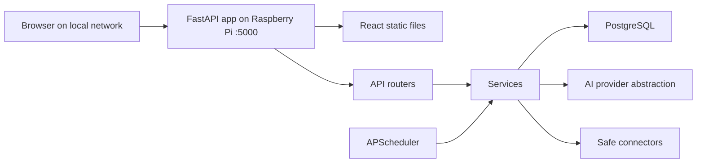

# Architecture

JobPilot Pi is a local-first web app with a FastAPI backend, React frontend, PostgreSQL database, and lightweight APScheduler worker.

## Runtime

## Backend Layers

- `routers`: request validation and response shaping.
- `services`: business logic for auth, collection, matching, assistant generation, and uploads.
- `models`: SQLAlchemy ORM models.
- `schemas`: Pydantic request and response models.
- `connectors`: job source adapters. The MVP ships with a safe mock connector.
- `ai`: provider abstraction with OpenAI and local fallback.
- `workers`: APScheduler jobs.

## Data Model

- `users`: local accounts and authentication state.
- `profiles`: resume metadata, skills, target role, location, preferences.
- `job_sources`: URL-based source definitions and scan cadence.
- `jobs`: deduplicated job metadata and match scores.
- `applications`: user-controlled draft workflow.
- `qa_memory`: reusable application answers.

## Security Boundary

The browser never receives provider API keys or password hashes. All secrets are read from environment variables. The app is designed for local-network use but still requires authentication.
